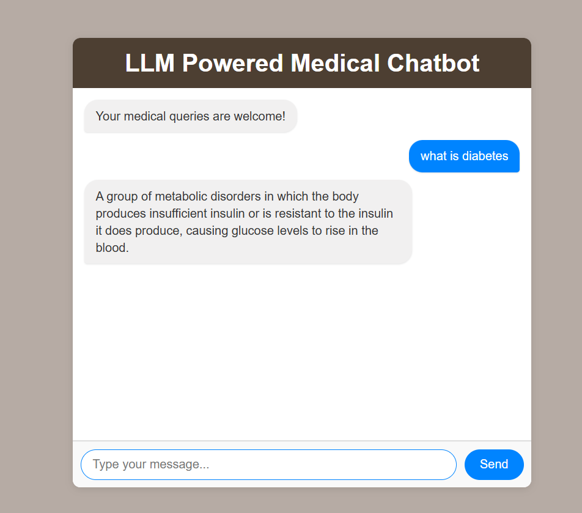

# Medical Chatbot with LangChain and Pinecone

This project implements a medical chatbot that can answer questions about diabetes by retrieving information from PDF documents. The chatbot uses LangChain for document processing, Pinecone for vector storage and retrieval, and Hugging Face for embeddings and language models. The project main code can be viewed from the `research` folder, `trails.ipynb`

## Features

- PDF document loading and text extraction
- Text chunking for efficient processing
- Vector embeddings using Hugging Face's sentence-transformers
- Vector storage and retrieval with Pinecone
- Question answering with context-aware responses
- Configurable response length (limited to 3 sentences)

## Prerequisites

Before running this project, ensure you have the following:

1. Python 3.10 or higher
2. The following API keys set as environment variables:
   - `PINECONE_API_KEY` - For Pinecone vector database access
   - `HUGGINGFACEHUB_API_TOKEN` - For Hugging Face model access
3. PDF documents in the `data/` directory

## Screenshots of the APP

